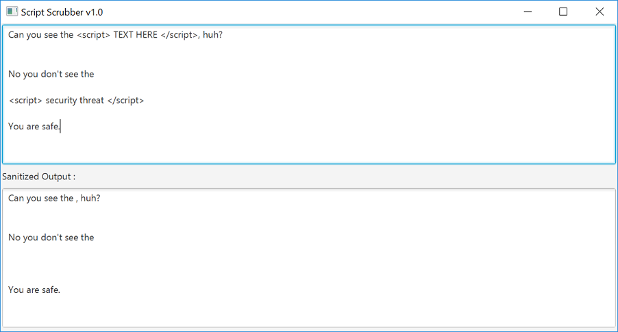

# scriptScrubber

Script Scrubber is a simple JavaFX app for sanitizing  blocks within a given multiline text.

## Usage

Run the app and enter the text as seen below :

## Contributing
Pull requests are welcome.
